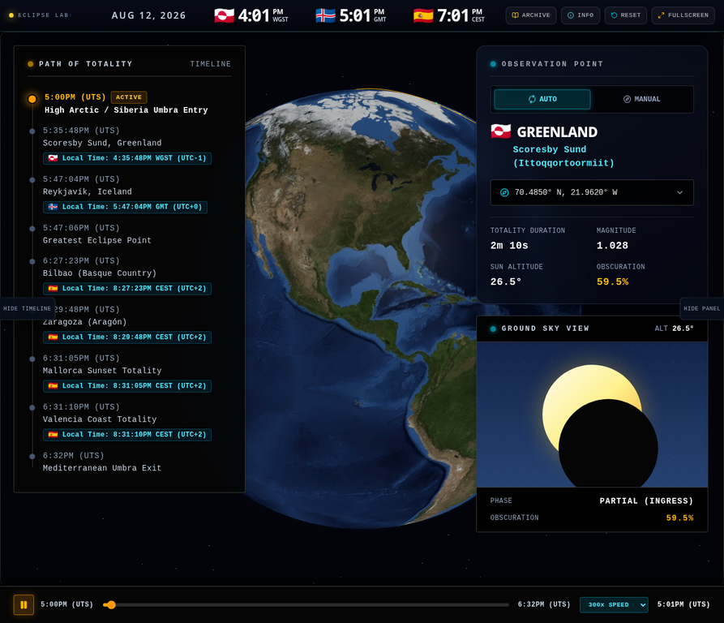

# Solar Sclipse

> **Explore totality. Replay history. See the shadow move.**
>
> An interactive 3D total solar eclipse simulator and historical eclipse archive built for visual exploration, astronomy education, and curiosity-driven discovery.

<div align="center">

[](https://solar-sclipse.pages.dev/)
[](https://react.dev/)
[](https://www.typescriptlang.org/)
[](https://threejs.org/)
[](LICENSE)

**[Open the live simulator →](https://solar-sclipse.pages.dev/)**

</div>

## Visual tour



The interface combines a rotatable Earth, a moving umbral path, observation-point telemetry, local clock readouts, a timeline scrubber, and a ground-level sky view in one focused workspace.

## What you can explore

| Experience | What it does |
|---|---|
| **3D eclipse globe** | Rotate and inspect Earth while the Moon’s umbral shadow travels across the surface. |
| **2026 totality mode** | Follow the 12 August 2026 path from the High Arctic through Greenland, Iceland, and Spain. |
| **Historical archive** | Browse notable total eclipses including 2134 BCE, 585 BCE, 1715, 1851, 1868, 1919, 1991, 1999, 2009, 2017, and 2024. |
| **Historical replay** | Launch an archived eclipse with its own date, route checkpoints, stations, timeline bounds, telemetry, and sky-view state. |
| **Observation telemetry** | Change stations and inspect totality duration, magnitude, solar altitude, obscuration, and eclipse phase. |
| **Path of totality** | Track ingress, greatest eclipse, local checkpoints, and umbra exit on a readable timeline. |
| **Responsive controls** | Use the simulator on desktop and mobile with explicit hide/show controls for the timeline and observation panels. |
| **Accessible interaction** | Keyboard focus states, descriptive controls, high-contrast accents, and reduced-motion support are included. |

## Historical replay workflow

1. Open **Archive** from the application header.
2. Search or browse the historical eclipse cards.
3. Select **Replay Simulation** on any event.
4. Explore the event-specific route, stations, date, telemetry, sky view, and playback timeline.
5. Use **Exit Replay** to return to the default 2026 simulation.

The archive is designed as an interactive educational overview. Historical route geometry is represented as a visual replay scenario rather than a precision ephemeris or navigation instrument.

## Run locally

You need **Node.js 18 or newer** and npm.

```bash
npm install
npm run dev
```

Open the local URL printed by Vite, normally `http://localhost:3000`.

Create and preview a production build with:

```bash
npm run build
npm run preview
```

## Technology

Solar Sclipse is built with **React**, **TypeScript**, **Vite**, **Tailwind CSS**, and **Three.js**. The public production build is deployed through **Cloudflare Pages** and automatically connected to the `main` branch of this repository.

## Project links

| Link | Destination |
|---|---|
| **Live simulator** | [solar-sclipse.pages.dev](https://solar-sclipse.pages.dev/) |
| **GitHub repository** | [github.com/Quincunx33/solar-sclipse](https://github.com/Quincunx33/solar-sclipse) |
| **Deployment platform** | [Cloudflare Pages](https://pages.cloudflare.com/) |

## Repository topics

`solar-eclipse` `eclipse-simulator` `astronomy` `space` `threejs` `react` `typescript` `vite` `cloudflare-pages` `interactive-visualization` `science-education`

## Data and references

The archive is a curated educational collection informed by public eclipse-history resources. For historical context and catalog information, see the [NASA Eclipse Web Site: Solar Eclipse History][1] and [NASA Solar Eclipses 2021–2030 catalog][2].

## License

This project is available under the MIT License. See [`LICENSE`](LICENSE) for details.

---

<div align="center">

**Built for curious minds looking up at the sky.**

[Launch Solar Sclipse](https://solar-sclipse.pages.dev/)

</div>

[1]: https://eclipse.gsfc.nasa.gov/SEhistory/SEhistory.html "NASA Eclipse Web Site: Solar Eclipse History"
[2]: https://eclipse.gsfc.nasa.gov/SEcatmax/SE2021-2030.html "NASA Eclipse Web Site: Solar Eclipses 2021–2030"

#solar-eclipse #eclipse-simulator #astronomy #space #threejs #react #typescript #vite #cloudflare-pages #interactive-visualization #science-education
